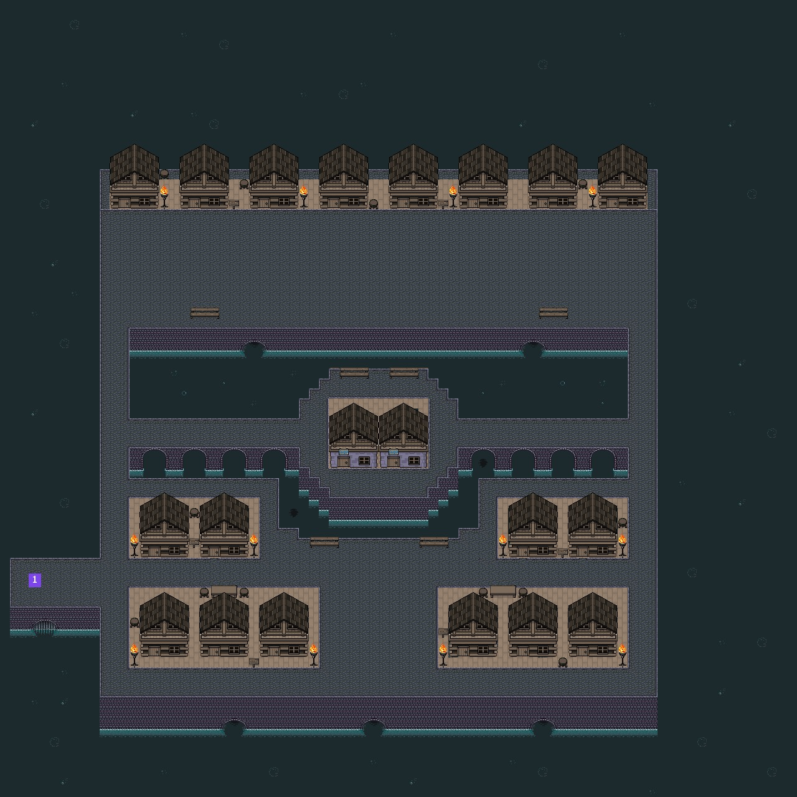
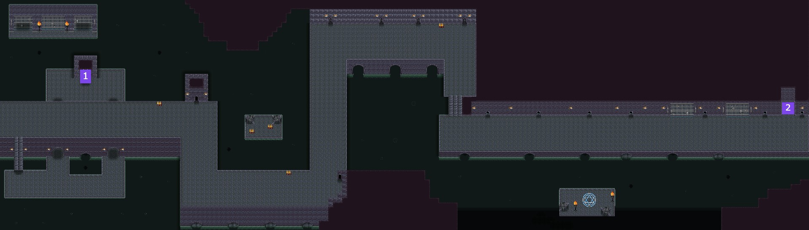
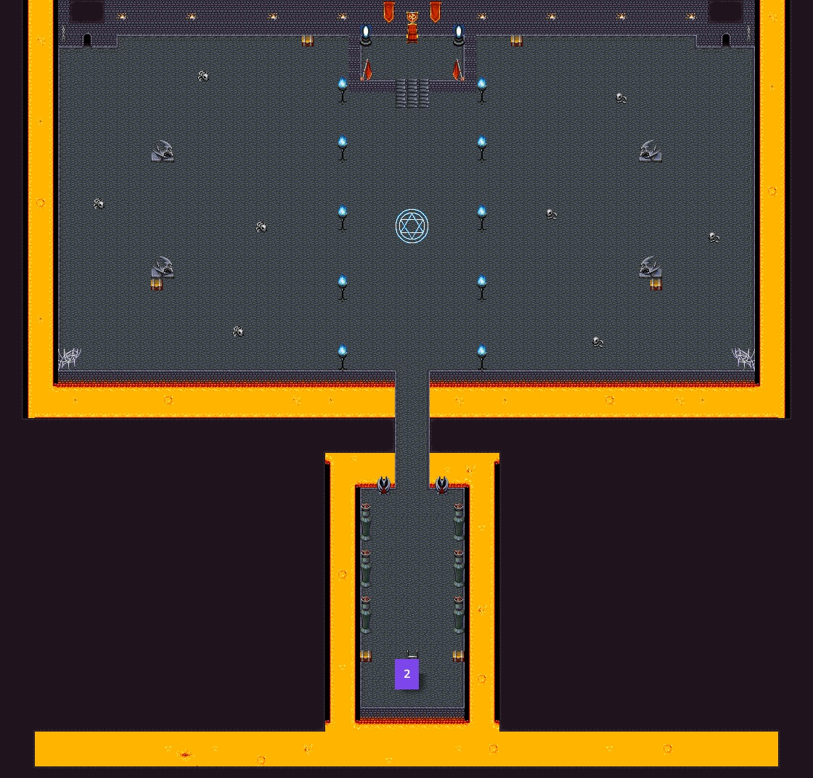

# Sewer Game

## Project
Small java game made with a game engine developed during a OOP class. The player and his trusty
ally, the tuvan throat singing monk, are tasked in finding and killing the rat mage. During his quest
the player will encounter zombies, rats and the mage.

## Map
### Town

### Sewer

### Boss room

## Boss fight
The boss is somewhat of a challenge, the rudimentary pathfinding is counter balanced with the mage's
teleporting. Also be wary of his attacks as he will either life steal on direct hits or use magic attacks
that teleport behind the player, which you can shoot to destroy.

## Controls
| Key      | Action |
| ----------- | ----------- |
|   Escape    | Close game       |
|   Space    | Fire       |
|   R    | Reload       |
|   E    | Explodes monk       |
|   1    | Switch to gun       |
|   2    | Switch to laser       |

## Secret Ending
To unlock the secret ending, one must follow these 3 easy steps :
1. Make monk explode, before reaching the boss room.
2. Kill the boss (An easy way to do this is to use the laser on the boss as soon as you enter the boss room)
3. Enjoy the secret ending!